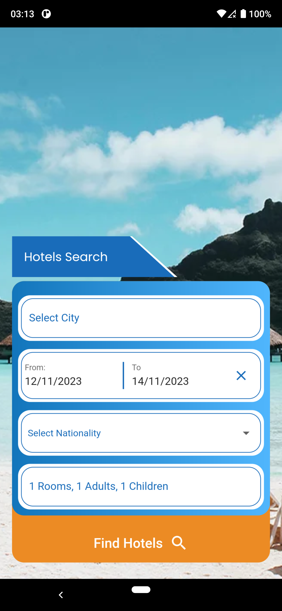

# hotelsgo

# Application structure

After successful build, your application structure should look like this:

```
.
├── android                         - It contains files required to run the application on an Android platform.
├── assets                          - It contains all images and fonts of your application.
├── ios                             - It contains files required to run the application on an iOS platform.
├── lib                             - Most important folder in the application, used to write most of the Dart code..
    ├── main.dart                   - Starting point of the application
    ├── core
    │   ├── export.dart             - It contains commonly used file imports
    │   └── utils                   - It contains common files and utilities of the application
    ├── localization                - It contains localization classes
    ├── presentation                - It contains widgets of the screens with their controllers and the models of the whole application.
    ├── routes                      - It contains all the routes of the application
    └── theme                       - It contains app theme and decoration classes
    └── widgets                     - It contains all custom widget classes
```

|[Alt text](assets/screenshot-2.png)
